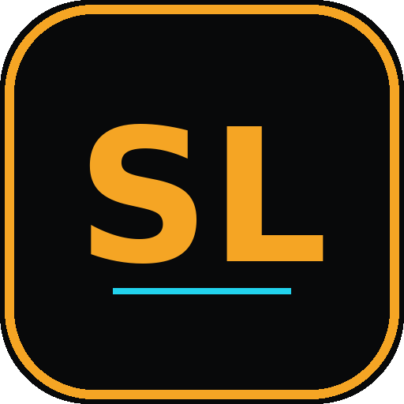

  

<h1 align="center">Smart Logistics</h1>

<b>Système de Gestion d'Entrepôt (WMS) — 100% Offline-First</b>

🇫🇷 Français · 🇩🇪 Deutsch

---

## 📦 À propos

**Smart Logistics** est une application professionnelle de gestion d'entrepôt, pensée pour fonctionner **entièrement hors connexion**, sur mobile, tablette ou ordinateur. Aucune donnée n'est envoyée sur un serveur : tout reste stocké localement sur votre appareil.

L'application est bilingue **Français / Allemand** (un bouton en haut de l'écran permet de changer de langue à tout moment).

---

## ✨ Fonctionnalités

- **Inventaire avancé** — suivi des articles, classification ABC, calcul automatique des marges, alerte visuelle de stock critique, recherche instantanée.
- **Mouvements de stock** — enregistrement des entrées et sorties avec motif et historique daté.
- **Fournisseurs** — carnet de contacts fournisseurs lié à vos articles.
- **Placement d'entrepôt intelligent** — indiquez le poids et la catégorie de rotation (ABC) d'un colis : l'emplacement optimal de l'entrepôt s'illumine automatiquement, sans consigne orale.
- **Tâches & rappels** — liste de tâches d'entrepôt avec échéances.
- **Rapport d'activité** — statistiques clés, suggestions de réapprovisionnement, graphique de valeur de stock par catégorie, export CSV.
- **Étiquettes articles** — génération d'une étiquette imprimable par référence.
- **Sauvegarde & restauration** — exportez et réimportez toutes vos données en un clic.
- **Rôles utilisateurs** — mode Administrateur (accès complet) ou Opérateur (lecture / scan uniquement), protégé par code PIN.
- **Journal d'activité** — historique des actions importantes de l'application.
- **Mode clair / sombre** — au choix, selon votre préférence visuelle.
- **Application installable (PWA)** — s'installe comme une vraie application sur l'écran d'accueil (voir ci-dessous).

---

## 🆓 Essai gratuit & licence

Smart Logistics est utilisable gratuitement pendant **7 jours** dès la première ouverture, sans inscription ni carte bancaire.

À l'ouverture de l'application, un **Identifiant Machine (Device ID)** unique à votre appareil s'affiche à l'écran. Cet identifiant :
- ne contient aucune donnée personnelle,
- sert uniquement à générer votre clé de licence,
- doit être communiqué lors de votre demande d'achat.

Un compte à rebours affiche en temps réel le temps restant de votre essai. Passé ce délai, une clé de licence valide est nécessaire pour continuer à utiliser l'application. La clé fonctionne **uniquement sur l'appareil pour lequel elle a été générée**.

### Comment obtenir une licence

1. Ouvrez l'application et copiez votre **Device ID** affiché à l'écran (bouton "Copier").
2. Choisissez votre formule dans la grille tarifaire.
3. Cliquez sur le plan souhaité, puis contactez-nous via WhatsApp ou Email (le message est pré-rempli automatiquement avec le plan choisi et votre Device ID).
4. Vous recevrez votre clé de licence à saisir directement dans l'application.

---

## 💰 Grille tarifaire (F CFA)

| Formule | Durée | Prix |
|---|---|---|
| Hebdomadaire | 7 jours | 8 000 F CFA |
| Bihebdomadaire | 14 jours | 15 000 F CFA |
| Mensuel | 30 jours | 25 500 F CFA |
| Bimestriel | 60 jours | 45 800 F CFA |
| Trimestriel | 90 jours | 63 800 F CFA |
| Semestriel | 180 jours | 115 000 F CFA |
| Annuel | 365 jours | 190 000 F CFA |
| 2 ans | 730 jours | 318 000 F CFA |
| 3 ans | 1095 jours | 418 000 F CFA |
| À vie | Accès illimité | 950 000 F CFA |

*Les tarifs affichés dans l'application font foi et peuvent évoluer.*

### 💱 Prix dans votre monnaie locale

Un sélecteur de pays au-dessus de la grille tarifaire permet d'afficher une **estimation** du prix dans votre devise locale (EUR, USD, GBP, CHF…) avec la TVA locale indicative incluse. Ces montants sont **fournis à titre informatif uniquement** — le tarif de référence, contractuel, reste toujours en **F CFA**.

---

## 🌐 Langues disponibles

- 🇫🇷 Français
- 🇩🇪 Deutsch (Allemand)

Changez de langue à tout moment via les drapeaux 🇫🇷 / 🇩🇪 en haut de l'écran.

---

## 📲 Installer l'application

Smart Logistics peut s'installer comme une application native sur votre écran d'accueil (PWA), sans passer par un store.

**Android / Chrome / Edge (ordinateur ou mobile)**
1. Ouvrez le lien de l'application dans votre navigateur.
2. Appuyez sur le bouton **« Installer l'app »** en haut de l'écran (ou menu ⋮ → *Installer l'application*).
3. Confirmez — une icône Smart Logistics apparaît sur votre écran d'accueil / bureau.

**iOS / Safari (iPhone, iPad)**
1. Ouvrez le lien de l'application dans Safari.
2. Appuyez sur l'icône **Partager** 🔼.
3. Sélectionnez **« Sur l'écran d'accueil »**.

Une fois installée, l'application s'ouvre en plein écran comme une app classique et fonctionne hors connexion.

---

## 🔒 Confidentialité & données

- Toutes vos données (inventaire, mouvements, fournisseurs, tâches, historique) sont stockées **uniquement sur votre appareil**, jamais transmises à un serveur.
- Rien n'est perdu en cas de fermeture du navigateur : les données restent enregistrées localement.
- Pensez à utiliser régulièrement la fonction **Sauvegarde** (dans *Paramètres*) pour exporter une copie de vos données.

---

## 📞 Support & Contact

Une question, un problème technique ou une demande de licence ?

- **WhatsApp** : +229 01 96 80 91 06
- **Email** : empiredonko@gmail.com

Des boutons de contact rapide sont disponibles directement dans l'application (écran d'accueil et bouton flottant).

---

Powered by <b>EMPIRE CODE</b>

